<div align="center">
  

# Rodi

**운전연습의 시작, 로디**

내 수준에 맞는 연습 장소와 코스를 발견하고,<br />
실제 도로 위 연습까지 이어갈 수 있도록 돕는 초보 운전자용 Android 앱입니다.

[](https://github.com/Central-MakeUs/Rodi-Android/actions/workflows/ci.yml)


<sub>Current version: 1.4.5 · minSdk 30 · targetSdk 36</sub>

[](https://play.google.com/store/apps/details?id=com.dororong.rodi)
</div>

---

## Why Rodi?

면허를 취득했다고 바로 익숙한 운전자가 되는 것은 아닙니다.

초보 운전자에게는 단순한 목적지 검색보다 다음 질문에 대한 답이 필요합니다.

- 지금 내 수준에서 어디를 연습하면 좋을까?
- 이 코스에서는 어떤 주행 상황을 경험하게 될까?
- 다른 운전자들은 이 장소를 어떻게 느꼈을까?
- 찾은 코스를 실제 운전으로 어떻게 이어갈까?

Rodi는 **탐색 → 등록 → 실제 연습 → 기록**을 하나의 경험으로 연결합니다.

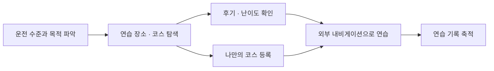

> **연습할 길을 찾는 순간부터, 혼자 달릴 수 있는 날까지.**

---

## Product Experience

<p align="center">
  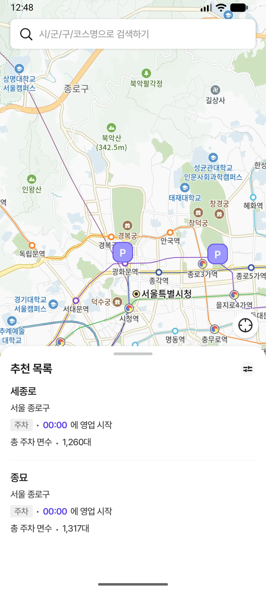
  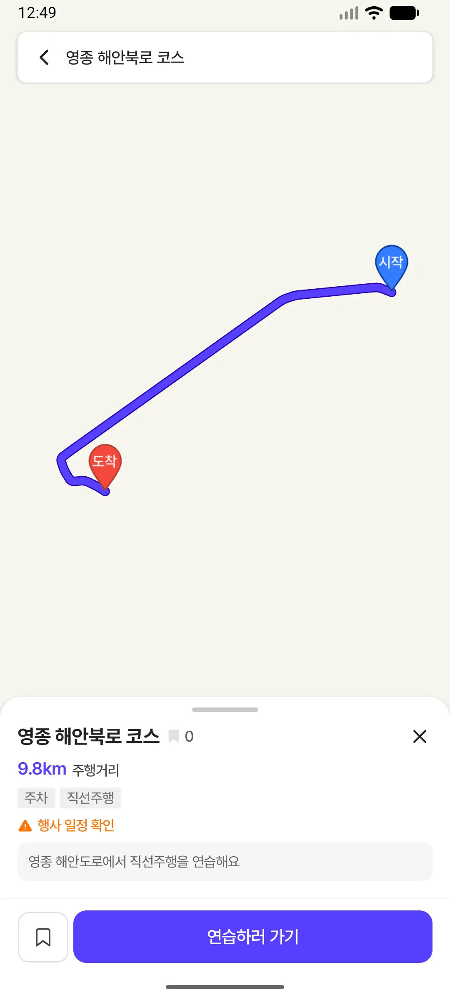
  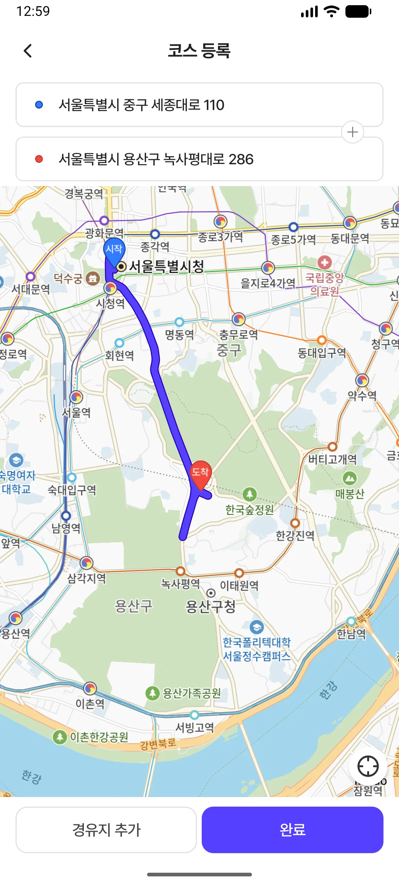
  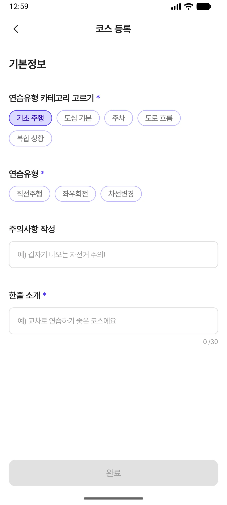
</p>

| Explore | Register | Practice |
| --- | --- | --- |
| 지도와 검색을 통해 연습 장소·코스를 탐색합니다. | 출발지·경유지·도착지를 선택해 실제 도로 기반 코스를 등록합니다. | 외부 내비게이션과 연결하고 연습 세션과 방문 기록을 관리합니다. |
| 지도 viewport · 검색 · 필터 · 상세 · 후기 | Kakao Local · Directions · Draft 복원 | Practice Session · Foreground Tracking · 기록 |

Rodi의 기능은 개별 화면보다 **사용자의 행동이 끝까지 이어지는 흐름**을 기준으로 설계합니다.

```text
진입 조건
  ↓
사용자 입력
  ↓
상태 전이
  ↓
Domain / Data
  ↓
성공 · 실패
  ↓
복귀 · 재진입
```

---

# Engineering Highlights

기능 구현 자체보다 **실제 사용자가 마주치는 경계 상황을 명확한 상태와 책임으로 표현하는 것**을 중요하게 생각했습니다.

## 01. `null` 하나로 표현할 수 없었던 위치 상태

### Problem

홈 첫 진입에서는 현재 위치를 확보하기 전에 기본 좌표로 조회했다가 현위치로 다시 이동하는 UX를 피하고 싶었습니다.

하지만 `currentLocation == null`만으로는 아래 두 상황을 구분할 수 없습니다.

```text
1. 아직 위치를 받아오는 중
2. 권한 거부 / GPS 실패로 위치를 받을 수 없음이 확정됨
```

둘을 같은 상태로 취급하면 위치 획득에 실패한 사용자가 **영구 로딩 상태에 남을 수 있습니다.**

### Decision

위치 값이 아니라 **위치 획득 과정 자체를 상태로 모델링**했습니다.

```kotlin
enum class InitialLocationState {
    Pending,
    Ready,
    Unavailable,
}
```

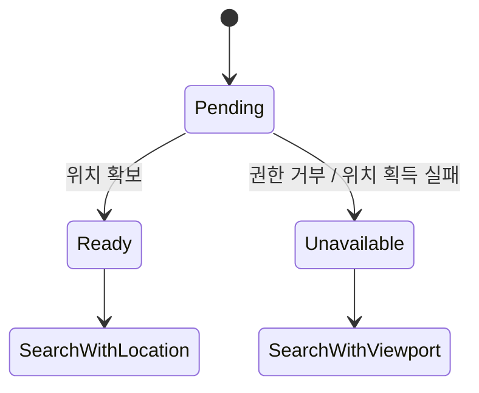

- `Pending` — 아직 결과를 기다려야 하므로 첫 조회를 보류합니다.
- `Ready` — 현위치 카메라 정착 후 viewport를 조회합니다.
- `Unavailable` — 현위치 대신 현재 지도 viewport로 정상 조회를 이어갑니다.

즉, **값이 없는 것과 값이 없다는 사실이 확정된 것을 서로 다른 상태로 취급**합니다.

- Code: [`InitialViewportSearchPolicy`](feature/home/src/main/java/com/dororong/rodi/feature/home/map/MapViewport.kt)
- Related: [PR #87 · 위치 미확보 시 홈 영구 로딩 수정](https://github.com/Central-MakeUs/Rodi-Android/pull/87)

---

## 02. 취소보다 늦게 도착한 응답을 어떻게 막을까?

### Problem

지도 viewport가 빠르게 바뀌면 이전 요청과 최신 요청이 동시에 존재할 수 있습니다.

```text
Viewport A 요청 ────────────────┐
                               ↓ 늦게 응답
Viewport B 요청 ────────┐
                        ↓ 먼저 응답
```

이때 이전 Job을 `cancel()`하는 것만으로는 충분하지 않을 수 있습니다. 이미 외부 계층에서 진행된 작업이 늦게 완료되면 **과거 viewport의 응답이 최신 화면을 덮어쓸 가능성**이 있습니다.

### Decision

요청을 취소하는 것과 별개로 `requestGeneration`을 증가시키고, 응답이 돌아왔을 때 현재 generation과 다시 비교합니다.

```kotlin
requestGeneration += 1
val generation = requestGeneration

firstPageJob?.cancel()

getPlacesUseCase(...)
    .onSuccess { page ->
        if (generation != requestGeneration) return@onSuccess
        applyFirstPage(query, page)
    }
```

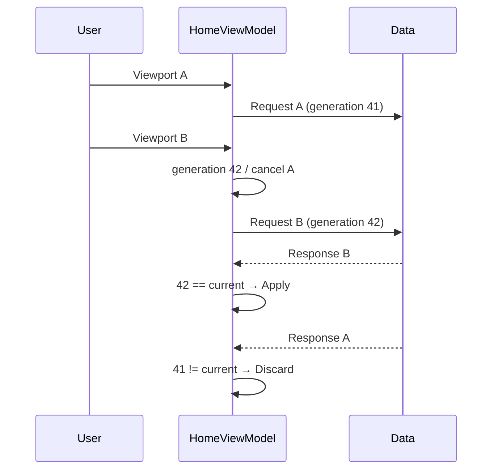

핵심은 **가장 늦게 도착한 응답이 아니라, 가장 최신 사용자 의도를 가진 응답만 상태를 변경하도록 하는 것**입니다.

- Code: [`HomeViewModel.loadFirstPage`](feature/home/src/main/java/com/dororong/rodi/feature/home/HomeViewModel.kt)

---

## 03. 기본 BottomSheet 대신 interaction을 직접 제어한 이유

### Problem

지도 위 코스 목록은 사용자가 손가락으로 직접 끌어 올리는 핵심 인터랙션입니다.

기존 Material3 `BottomSheetScaffold`에서는 작은 드래그에도 다음 anchor로 빠르게 이동해 손가락을 1:1로 따라가는 느낌이 부족했고, 드래그 offset에 반응하는 값들이 Composition 단계에서 읽히며 무거운 지도 화면에서 불필요한 갱신도 발생했습니다.

### Decision

`BottomSheetScaffold`를 Compose Foundation의 `AnchoredDraggableState` 기반 구조로 교체했습니다.

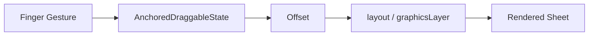

구현에서는 다음을 분리했습니다.

- **Gesture ownership** — 헤더만 Sheet drag를 소유하고 목록 본문은 독립적으로 스크롤
- **State validity** — Empty/Error 상태에서는 존재할 수 없는 Full anchor 자체를 제거
- **Frame update** — 위치·크기처럼 프레임 단위 값은 가능한 경우 `layout` / `graphicsLayer`에서 반영
- **Side effect timing** — 지도 padding·마커 재배치는 드래그 중이 아니라 Sheet가 정착한 뒤 수행
- **Testability** — anchor 계산 정책은 순수 함수로 분리해 JVM 단위 테스트

단순히 애니메이션을 부드럽게 만드는 것이 아니라 **상태, gesture, Compose phase, 외부 Map side effect를 서로 다른 책임으로 분리**했습니다.

- Code: [`HomeScreen`](feature/home/src/main/java/com/dororong/rodi/feature/home/HomeScreen.kt)
- Related: [PR #77 · 리스트/상세 바텀시트를 손가락 추적 드래그로 전환](https://github.com/Central-MakeUs/Rodi-Android/pull/77)

---

## 04. 이모지 하나는 정말 `1글자`일까?

### Problem

사용자는 입력창에서 이모지 30개를 입력했고 UI에서도 `30 / 30`으로 보였지만, 실제 저장 과정에서는 절반만 남는 문제가 있었습니다.

문제는 문자열 길이를 바라보는 단위가 서로 달랐다는 점입니다.

```text
사용자가 인식하는 글자
😀

Grapheme Cluster
1

UTF-16 Code Unit
2
```

Grapheme 기준으로 한 번 제한한 뒤 UTF-16 code unit 기준 제한을 다시 적용하면, surrogate pair를 사용하는 이모지는 사실상 두 번 차감됩니다.

### Decision

사용자가 인식하는 입력 길이는 **grapheme cluster 기준**으로 처리하고 Android 런타임에서는 `android.icu.text.BreakIterator`를 사용합니다.

여기서 구현 위치도 함께 고려했습니다.

`core:common`은 Android SDK를 모르는 순수 Kotlin/JVM 영역이므로 Android ICU 의존 코드를 그대로 두지 않고 Android 의존성이 허용되는 영역으로 분리했습니다.

```text
User Input
   ↓
Grapheme segmentation
   ↓
UI limit
   ↓
Domain / Repository validation
   ↓
Server contract
```

**공통으로 쓰인다는 이유보다 그 코드가 요구하는 의존성 경계를 우선했습니다.**

- Code: [`GraphemeText.kt`](core/ui/src/main/java/com/dororong/rodi/core/ui/text/GraphemeText.kt)
- Related: [PR #91 · 이모지 입력이 절반으로 잘리던 문제 수정](https://github.com/Central-MakeUs/Rodi-Android/pull/91)

---

# Architecture

Rodi는 **Multi-module + Clean Architecture**를 기반으로 외부 기술과 비즈니스 정책의 변경 경계를 나눕니다.

핵심 규칙은 다음과 같습니다.

> UI와 외부 시스템의 구현이 바뀌어도 Domain의 정책 계약은 직접 영향을 받지 않아야 합니다.

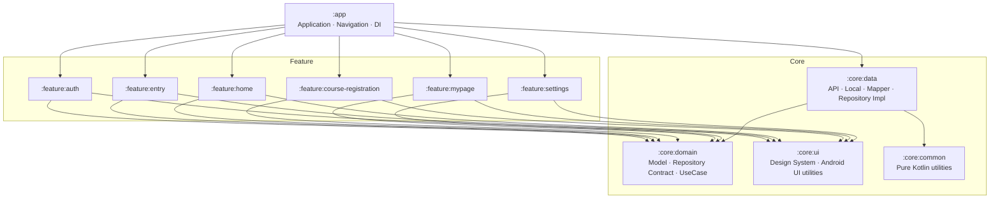

## Dependency Rule

```text
app → feature:*
app → core:data → core:domain
feature:* → core:domain
feature:* → core:ui / core:common
```

`core:domain`은 Android, Compose, Retrofit, Room, Kakao SDK를 직접 참조하지 않습니다.

또한 Feature끼리 직접 의존하지 않고 화면 전환은 `app`의 route가 조정합니다.

## Module Responsibility

| Module | Responsibility |
| --- | --- |
| `:app` | Application entry, Navigation 3, Hilt graph, feature orchestration |
| `:core:domain` | Domain model, Repository contract, UseCase |
| `:core:data` | Retrofit API, DTO, mapper, Repository implementation, Room, DataStore, security |
| `:core:ui` | Rodi Design System, reusable Compose component, Android UI utility |
| `:core:common` | Android-independent Kotlin utility |
| `:feature:auth` | Kakao login, authentication, account recovery |
| `:feature:entry` | Terms, onboarding, permissions |
| `:feature:home` | Map, search, place/course exploration, detail, practice entry |
| `:feature:course-registration` | Course draft, location search, waypoint selection, route validation, submit |
| `:feature:mypage` | Profile, saved places, practice history, user contents |
| `:feature:settings` | Settings, permissions, terms, account settings |
| `:benchmark` | Startup Macrobenchmark, Baseline Profile |

더 자세한 의존 방향과 패키지 규칙은 [`ARCHITECTURE_TARGET.md`](docs/ARCHITECTURE_TARGET.md)에 정리되어 있습니다.

---

# UI State Flow

Rodi의 화면은 strict reducer 기반 MVI를 강제하기보다, Android SDK와 Compose lifecycle을 함께 다룰 수 있도록 **Contract 기반 UDF / MVI-style 구조**를 사용합니다.

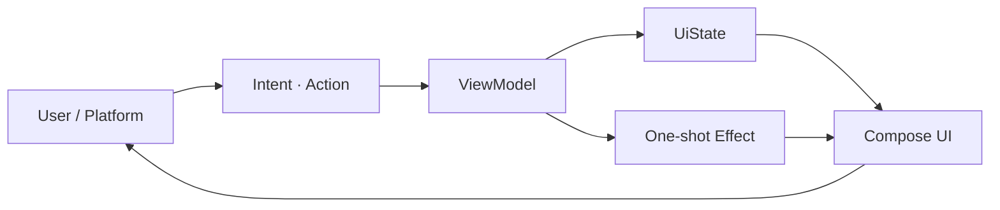

- 화면의 지속 상태는 `StateFlow<UiState>`로 전달합니다.
- Navigation, Snackbar, 외부 앱 실행처럼 한 번 소비해야 하는 사건은 별도 Effect로 전달합니다.
- Map SDK나 gesture처럼 lifecycle이 다른 플랫폼 상태는 Screen-local state와 ViewModel state의 소유권을 구분합니다.

즉, **화면의 모습과 한 번 발생하는 사건을 같은 상태에 섞지 않는 것**을 기본 원칙으로 둡니다.

---

# Reliability

실서비스에서는 Happy Path보다 **실패한 뒤 앱이 어떤 상태로 남는지**가 중요합니다.

| Situation | Strategy |
| --- | --- |
| 현재 위치 획득 실패 | `Unavailable`로 확정하고 현재 지도 viewport로 조회 |
| 지도/검색 요청 경합 | Job 취소 + generation 검증으로 stale response 폐기 |
| 다음 페이지 조회 실패 | 이미 로드한 목록은 유지하고 추가 조회 실패만 별도 처리 |
| 외부 내비 후 앱 복귀 | 저장된 Practice Session을 다시 확인 |
| 서버 schema drift | 기본값으로 덮기 전에 Swagger와 DTO/Mapper 계약 재대조 |
| 알 수 없는 서버 enum | 계약에 따라 명시적 mapping 또는 안전한 fallback |
| Coroutine cancellation | 일반 실패로 삼키지 않고 cancellation 의미 보존 |
| Tutorial 완료 저장 실패 | 사용자의 핵심 진행은 허용하고 이후 다시 동기화 가능 |
| Offline | 짧은 유예 후 안내하고 재연결 시 복구 |

## Failure severity follows user impact

모든 오류를 동일하게 blocking하지 않습니다.

```text
반드시 현재 흐름을 중단해야 하는 실패
            │
대체 경로로 계속 진행 가능한 실패
            │
나중에 다시 동기화할 수 있는 실패
```

예를 들어 코스 등록 튜토리얼 완료 상태의 서버 저장이 일시적으로 실패하더라도 사용자를 튜토리얼에 가두지 않고 지도 단계로 진행하게 합니다.

- Related: [PR #98 · 튜토리얼 완료 저장 실패를 non-blocking 처리](https://github.com/Central-MakeUs/Rodi-Android/pull/98)

---

# Verification Strategy

**코드가 존재하는 것, 빌드가 성공하는 것, 기능이 실제로 동작하는 것은 서로 다른 증거**로 취급합니다.

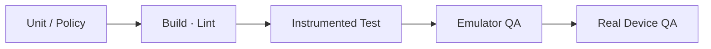

필요한 검증 수준은 문제의 경계에 맞춥니다.

| Boundary | Preferred verification |
| --- | --- |
| Pure policy / mapper / state transition | JVM Unit Test |
| Coroutine / Flow | `kotlinx-coroutines-test`, Turbine |
| Compose interaction | Compose UI Test |
| Gesture / lifecycle / MapView | Instrumented Test, Emulator |
| Permission / 외부 SDK / 실제 앱 복귀 | Real Device QA when needed |

특히 UI interaction 로직이라도 계산 가능한 정책은 순수 함수로 분리해 빠르게 회귀 테스트하고, 실제 gesture와 Android lifecycle이 필요한 부분만 Android 환경에서 검증합니다.

CI에서는 Pull Request와 `develop` push에 대해 다음을 다시 실행합니다.

```bash
./gradlew assembleDebug
./gradlew test
./gradlew lint
```

테스트 작성 규칙은 [`TESTING.md`](docs/TESTING.md)에 정리되어 있습니다.

---

# Engineering Workflow

구현을 시작하기 전에 자연어 요구사항을 **검증 가능한 범위와 Acceptance Criteria**로 바꾸고, 구현 결과는 독립적인 검토와 실행 증거를 거쳐 확인합니다.

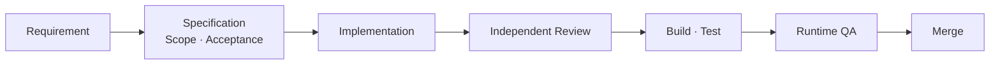

이 과정에서 중요하게 보는 원칙은 다음과 같습니다.

- 구현자가 만든 코드가 있다는 사실만으로 완료를 판단하지 않습니다.
- 검증하지 못한 항목은 성공으로 표현하지 않습니다.
- 특정 화면 문제를 해결하기 위해 전역 컴포넌트를 불필요하게 변경하지 않습니다.
- 외부 API 계약이 부족하면 클라이언트에서 값을 추측해 만들어내지 않습니다.
- 실패한 시도는 다음 작업에서 반복되지 않도록 프로젝트 규칙과 회귀 테스트로 남깁니다.

---

# Performance

지도와 BottomSheet처럼 프레임 단위 업데이트가 많은 화면에서는 **상태를 어디에서 읽느냐**도 설계의 일부로 봅니다.

```text
Composition
    ↓
Layout
    ↓
Draw
```

모든 프레임 의존 값을 Composition에서 읽기보다, 위치·크기·투명도처럼 렌더링 단계에서만 필요한 값은 가능한 경우 `Modifier.layout { ... }`, `Modifier.graphicsLayer { ... }`처럼 더 뒤쪽 phase에서 처리합니다.

## Cold Start Performance

프로젝트에는 실제 앱 시작 성능을 검증하기 위한 `:benchmark` 모듈과 Baseline Profile 인프라를 구성했습니다.

Baseline Profile 적용 효과를 동일 실기기에서 8회 반복 측정한 결과입니다.

| | Without Baseline Profile | With Baseline Profile | Improvement |
| --- | ---: | ---: | ---: |
| Median | 403ms | 281ms | **30.3%** |
| Average | 452ms | 293ms | **35.3%** |

> SM-M446K · Real Device · 8 runs · 2026-08-24

대표 지표는 이상치의 영향을 덜 받는 중앙값으로 선택했으며,  
Baseline Profile 적용 후 Cold Start 시간이 **403ms → 281ms, 약 30.3% 감소**했습니다.

---

# Design System

제품의 시각 언어는 화면마다 임의로 복제하지 않고 `core:ui`에서 관리합니다.

```text
Figma
  ↓
Design Token
  ↓
RodiTheme
  ↓
Reusable Component
  ↓
Feature UI
```

```kotlin
RodiTheme.colors
RodiTheme.typography
RodiTheme.spacing
RodiTheme.radius
```

공용 UI 컴포넌트는 주요 상태와 variant를 Preview로 확인할 수 있도록 관리하고, Feature는 제품 고유의 business rule에 집중합니다.

---

# Tech Stack

| Category | Stack |
| --- | --- |
| Language | Kotlin 2.2.10 · Java 21 |
| UI | Jetpack Compose · Material 3 · Rodi Design System |
| Architecture | Multi-module · Clean Architecture · Contract-based UDF / MVI-style |
| Navigation | AndroidX Navigation 3 |
| Async | Coroutines · Flow · StateFlow · Channel |
| DI | Hilt · KSP |
| Network | Retrofit · OkHttp · kotlinx.serialization |
| Local | Room · DataStore |
| Security | Android Keystore · AES-GCM |
| Map | Kakao Map SDK |
| Route | Kakao Mobility Directions |
| Auth | Kakao Login |
| External Navigation | Kakao Navi |
| Analytics | Microsoft Clarity |
| Test | JUnit 5 · MockK · Turbine · Coroutines Test · Compose UI Test |
| Performance | Macrobenchmark · Baseline Profile |
| Automation | GitHub Actions |

---

# Development Principles

1. **상태를 의미 없이 Boolean으로 압축하지 않습니다.**  
   가능한 상태가 세 개 이상이라면 이름을 가진 상태 모델이 더 정확한지 먼저 검토합니다.

2. **Framework보다 Domain의 정책 계약이 오래 살아남게 합니다.**  
   Android나 Retrofit 타입을 몰라도 핵심 규칙을 이해할 수 있는 경계를 지향합니다.

3. **최신 사용자 의도를 오래된 비동기 응답이 덮지 않게 합니다.**  
   cancellation만 믿지 않고 필요하면 generation, key, id를 함께 검증합니다.

4. **실패는 사용자 영향도에 따라 다르게 처리합니다.**  
   blocking, fallback, retryable failure를 구분합니다.

5. **UI 문제도 상태와 렌더링 단계까지 추적합니다.**  
   픽셀 조정보다 gesture ownership, recomposition, layout/draw phase의 원인을 먼저 확인합니다.

6. **서버 계약을 추측하지 않습니다.**  
   파싱 오류나 enum 불일치가 발생하면 기본값으로 숨기기 전에 실제 API schema와 대조합니다.

7. **검증하지 않은 것을 완료라고 부르지 않습니다.**  
   Unit Test, Build, Emulator, Real Device는 각각 다른 수준의 증거입니다.

---

# Local Development

<details>
<summary><strong>실행 방법 보기</strong></summary>

## Requirements

- Android Studio
- Android SDK
- JDK 21
- Android 11+
- Kakao Native App Key
- Kakao REST API Key

## Clone

```bash
git clone git@github.com:Central-MakeUs/Rodi-Android.git
cd Rodi-Android
```

## Secrets

루트의 `local.properties`에 필요한 키를 설정합니다.

```properties
sdk.dir=/your/android/sdk/path
KAKAO_NATIVE_APP_KEY=your_native_app_key
KAKAO_REST_API_KEY=your_rest_api_key
```

실제 Key와 `local.properties`는 버전 관리에 포함하지 않습니다.

## Build

```bash
./gradlew assembleDebug
```

## Test

```bash
./gradlew test
```

## Lint

```bash
./gradlew lint
```

## Release Build

릴리스 서명 환경이 구성된 경우 다음 명령으로 release build를 검증할 수 있습니다.

```bash
./gradlew assembleRelease
```

</details>

---

# Documentation

| Document | Description |
| --- | --- |
| [`PROJECT.md`](docs/PROJECT.md) | 버전, 프로젝트 사실, 공통 개발 규칙 |
| [`ARCHITECTURE_TARGET.md`](docs/ARCHITECTURE_TARGET.md) | 모듈 의존 방향과 패키지 기준 |
| [`TESTING.md`](docs/TESTING.md) | 테스트 도구와 작성 규칙 |
| [`BACKLOG.md`](docs/BACKLOG.md) | 후속 작업과 기술 부채 |

---

<div align="center">
  <strong>연습할 길을 찾는 순간부터 혼자 달릴 수 있는 날까지, Rodi가 함께합니다.</strong>
</div>
