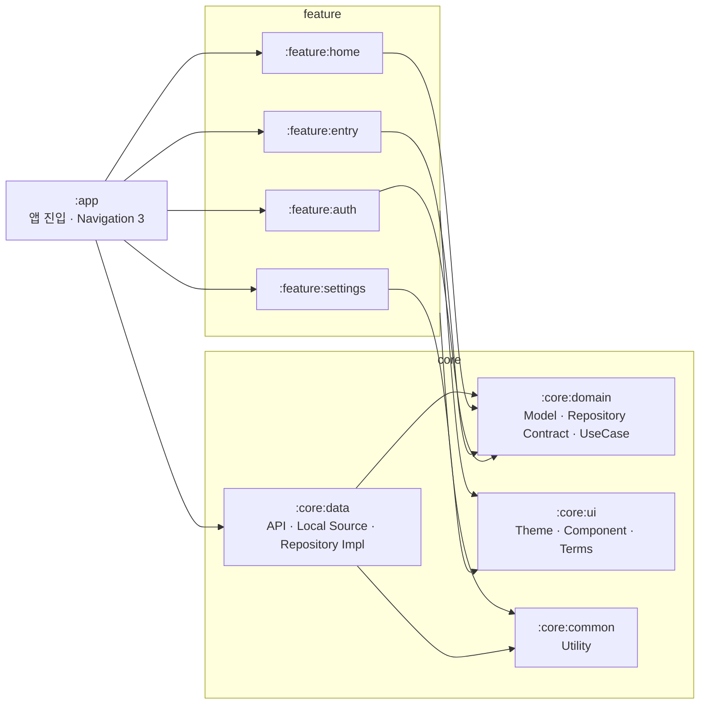

<div align="center">
  

  # Rodi

  **운전연습의 시작, 로디**

  내 수준에 맞는 연습 코스를 발견하고<br />
  망설임 없이 실제 도로 위 첫걸음을 내딛도록 돕는 초보 운전자용 Android 앱입니다

  [](https://github.com/Central-MakeUs/Routi-Android/actions/workflows/ci.yml)
  
  
  
</div>

---

## 운전은 배웠지만, 어디서 연습해야 할지 막막했다면

면허를 땄다고 바로 익숙한 운전자가 되는 것은 아닙니다

초보 운전자에게는 지금 내 수준에 맞는 도로가 어디인지, 어떤 상황을 연습해야 하는지, 실제 주행을 어떻게 시작해야 하는지 알려주는 다음 단계가 필요합니다

Rodi는 이 막막함을 하나의 흐름으로 연결합니다

> **나를 이해하는 과정 → 연습할 길의 발견 → 실제 주행으로 이어지는 경험**

## Rodi가 바라보는 방향

- 운전 경험과 자신감이 서로 다른 사용자를 이해합니다
- 초보 운전자가 부담 없이 연습할 수 있는 길을 발견하도록 돕습니다
- 정보를 보여주는 데서 끝나지 않고 실제 운전으로 이어지는 경험을 지향합니다

## 현재 개발 단계

Rodi는 현재 `1.1.0-alpha01` 단계로 제품의 핵심 흐름과 기술 기반을 함께 검증하고 있습니다

현재 저장소에는 사용자 진입과 운전연습 탐색 등 주요 흐름을 검증하기 위한 구현이 포함되어 있습니다

세부 기능과 화면 구성, 데이터 계약은 개발 과정에서 달라질 수 있으므로 이 README에서는 확정된 기능 목록보다 제품의 방향과 기술 구조를 중심으로 소개합니다

## 기술 스택

| 분류 | 기술 |
|---|---|
| Language | Kotlin 2.2.10, Java 21 |
| UI | Jetpack Compose, Material 3, Rodi Design System, Pretendard |
| Architecture | Multi-module, Clean Architecture, MVI, Repository, UseCase |
| Navigation | AndroidX Navigation 3 |
| Async | Coroutines, Flow, StateFlow |
| DI | Hilt, KSP |
| Network | Retrofit, OkHttp, kotlinx.serialization |
| Local | DataStore, Room 기반 데이터 레이어, Android Keystore AES-GCM |
| Map · Auth | Kakao Map SDK, Kakao Mobility Directions, Kakao Login, Kakao Navi |
| Test | JUnit 5, MockK, Turbine, Coroutines Test, Compose UI Test |
| Performance | Macrobenchmark, Baseline Profile |
| Automation | GitHub Actions CI, 태그 기반 GitHub Release |

## 아키텍처

기능 간 직접 의존을 만들지 않고 `app`이 화면 전환을 조정합니다<br />
비즈니스 규칙은 Android 프레임워크를 모르는 `core:domain`에 두고, 외부 시스템 구현은 `core:data`가 담당합니다



### 모듈 구성

| 모듈 | 책임 |
|---|---|
| `:app` | `MainActivity`, 앱 전역 진입 상태, Navigation 3 라우팅 |
| `:core:domain` | 도메인 모델, Repository 계약, UseCase |
| `:core:data` | API, DTO, mapper, DataStore, 보안 저장소, Repository 구현 |
| `:core:ui` | `RodiTheme`, 디자인 토큰, 공용 컴포넌트, 약관 WebView |
| `:core:common` | 공통 확장 함수와 유틸리티 |
| `:feature:auth` | 카카오 로그인과 게스트 진입 |
| `:feature:entry` | 약관, 온보딩 설문, 안전 수칙, 위치 권한 |
| `:feature:home` | 지도, 코스 탐색, 상세 바텀시트, 내비 실행 |
| `:feature:settings` | 설정, 약관 목록과 WebView |
| `:benchmark` | 시작 성능 측정과 Baseline Profile 생성 |

더 자세한 의존 방향과 패키지 기준은 [ARCHITECTURE_TARGET.md](docs/ARCHITECTURE_TARGET.md)에서 확인할 수 있습니다

## 설계에서 중요하게 보는 것

### 화면이 아니라 역할을 기준으로 나누기

Feature는 화면과 상태를 소유하고, Domain은 비즈니스 규칙을, Data는 외부 구현을 소유합니다<br />
Repository interface와 구현을 분리해 지도, 서버, 로컬 저장소가 바뀌어도 핵심 규칙이 흔들리지 않게 합니다

### 상태와 일회성 이벤트 구분하기

각 Feature는 `UiState`, `Intent`, `Effect`를 기준으로 상태 흐름을 표현합니다<br />
화면 복원에 필요한 값은 `StateFlow`, 내비 실행이나 화면 이동 같은 일회성 동작은 `Channel` 기반 Effect로 전달합니다

### 디자인 시스템을 제품의 언어로 사용하기

색상과 타이포그래피는 `RodiTheme.colors`, `RodiTheme.typography` 토큰만 사용합니다<br />
Material 기본 아이콘에 기대지 않고 Rodi의 에셋과 공용 컴포넌트를 통해 화면의 인상을 일관되게 유지합니다

### 실패해도 안전한 방향으로

길찾기 실패는 직선 경로로, 손상된 인증 정보는 로그아웃 상태로, 취소된 코루틴은 상위로 전파되도록 설계합니다<br />
성공 케이스만큼 실패 이후의 사용자 경험과 데이터 정합성을 중요하게 다룹니다

## 로컬에서 실행하기

### 요구 환경

- Android Studio와 Android SDK
- JDK 21
- Android 11 이상 기기 또는 에뮬레이터
- Kakao Developers에서 발급한 Native App Key와 REST API Key

### 1. 저장소 받기

```bash
git clone git@github.com:Central-MakeUs/Routi-Android.git
cd Routi-Android
```

### 2. 키 설정하기

루트의 `local.properties`에 아래 값을 추가합니다

```properties
sdk.dir=/your/android/sdk/path
KAKAO_NATIVE_APP_KEY=your_native_app_key
KAKAO_REST_API_KEY=your_rest_api_key
```

`local.properties`와 실제 키는 절대 커밋하지 않습니다

### 3. 빌드하고 실행하기

```bash
./gradlew assembleDebug
```

Android Studio에서 `app` 구성을 선택해 실행하거나 아래 명령으로 주요 검증을 수행할 수 있습니다

```bash
./gradlew test
./gradlew lint
./gradlew assembleRelease
```

테스트 작성 기준은 [TESTING.md](docs/TESTING.md)에 정리되어 있습니다

## 개발 원칙

- 모든 변경은 `assembleDebug`가 통과하는 상태로 마무리합니다
- 핵심 UseCase와 ViewModel의 상태 전이를 단위 테스트로 검증합니다
- Feature끼리 직접 의존하지 않고 앱 라우트에서 화면 이동을 조정합니다
- 색상과 타이포그래피는 디자인 토큰만 사용합니다
- 인증 키와 로컬 시크릿은 버전 관리에 포함하지 않습니다
- PR마다 빌드, 단위 테스트, lint를 CI에서 다시 검증합니다

## 더 알아보기

- [PROJECT.md](docs/PROJECT.md) — 버전, 모듈, 프로젝트 공통 컨벤션
- [ARCHITECTURE_TARGET.md](docs/ARCHITECTURE_TARGET.md) — 의존 방향과 패키지 구조
- [TESTING.md](docs/TESTING.md) — 테스트 도구와 작성 규칙
- [BACKLOG.md](docs/BACKLOG.md) — 후속 작업과 기술 부채

---

<div align="center">
  <strong>연습할 길을 찾는 순간부터 혼자 달릴 수 있는 날까지, Rodi가 함께합니다</strong>
</div>
